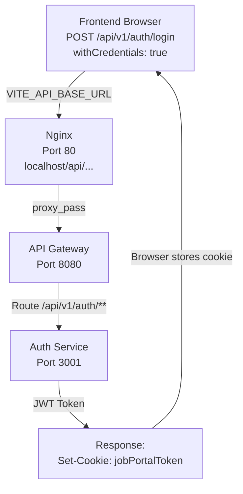
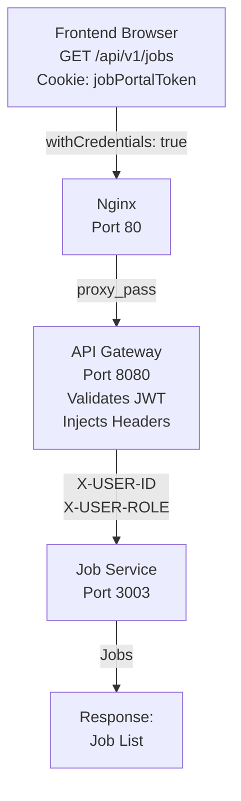

# 🎯 FRONTEND ROUTING - COMPLETE SOLUTION

## Quick Summary

✅ **All frontend API requests now route exclusively through API Gateway (port 8080)**

**What Changed**:
1. `.env`: `localhost:3000` → `localhost:8080`
2. `FetchHandlers.js`: Fallback `3000` → `8080` + `withCredentials: true` on all methods
3. `nginx.conf`: `backend:3000` → `api-gateway:8080`

**Result**: Frontend never calls individual service ports. All APIs go through single entry point.

---

## Before vs After

### BEFORE (❌ Broken)
```
Frontend → localhost:3000 (doesn't exist, old monolith)
or
Frontend → localhost:3001, 3002, 3003, 3004 (hardcoded ports)
or
Nginx → backend:3000 (non-existent service)
```

### AFTER (✅ Fixed)
```
Frontend → VITE_API_BASE_URL (http://localhost:8080)
    ↓
Nginx → http://api-gateway:8080
    ↓
API Gateway → routes to correct service
    ↓
Microservice responds
```

---

## Three Key Files Fixed

### 1. **Environment Configuration** (`full-stack-job-portal-client-main/.env`)

```diff
# BEFORE
- VITE_API_BASE_URL=http://localhost:3000

# AFTER
+ VITE_API_BASE_URL=http://localhost:8080
```

**Impact**: Frontend now points to API Gateway

---

### 2. **API Client** (`src/utils/FetchHandlers.js`)

```javascript
// BEFORE
const API_BASE_URL = import.meta.env.VITE_API_BASE_URL || 'http://localhost:3000';
export const updateHandler = async ({ url, body }) => {
    const res = await axios.patch(buildApiUrl(url), body);  // ❌ No credentials
    return res?.data?.result;
};

// AFTER
const API_BASE_URL = import.meta.env.VITE_API_BASE_URL || 'http://localhost:8080';
export const updateHandler = async ({ url, body }) => {
    const res = await axios.patch(buildApiUrl(url), body, { withCredentials: true });  // ✅
    return res?.data?.result;
};
```

**Impact**: All requests include cookies for JWT authentication

---

### 3. **Nginx Configuration** (`nginx.conf`)

```diff
# BEFORE
- location /api/ {
-     proxy_pass http://backend:3000;

# AFTER
+ location /api/ {
+     proxy_pass http://api-gateway:8080;
```

**Impact**: Frontend container routes to API Gateway

---

## How It Works (Request Flow)

### Example: Login Request



### Example: Subsequent Request (with JWT)



---

## Complete API Routes

All routes go through **http://localhost:8080**:

| API Path | Method | Service | JWT Required |
|----------|--------|---------|--------------|
| `/api/v1/auth/register` | POST | Auth | ❌ |
| `/api/v1/auth/login` | POST | Auth | ❌ |
| `/api/v1/users` | PATCH | User | ✅ |
| `/api/v1/users` | GET | User | ✅ (Admin) |
| `/api/v1/users/{id}` | DELETE | User | ✅ (Admin) |
| `/api/v1/admin/info` | GET | User | ✅ (Admin) |
| `/api/v1/admin/stats` | GET | User | ✅ (Admin) |
| `/api/v1/jobs` | GET | Job | ❌ |
| `/api/v1/jobs` | POST | Job | ✅ (Recruiter) |
| `/api/v1/jobs/{id}` | GET | Job | ❌ |
| `/api/v1/jobs/{id}` | PATCH | Job | ✅ |
| `/api/v1/jobs/{id}` | DELETE | Job | ✅ |
| `/api/v1/applications/apply` | POST | Application | ✅ |
| `/api/v1/applications` | GET | Application | ✅ |

---

## Environment Variables

### Development (Local)
```dotenv
VITE_API_BASE_URL=http://localhost:8080
```
Frontend runs on `http://localhost:3000` (Vite), APIs on `localhost:8080`

### Docker
```dotenv
VITE_API_BASE_URL=http://api-gateway:8080
```
Frontend runs on `localhost:80`, APIs on internal network `api-gateway:8080`

### Production
```dotenv
VITE_API_BASE_URL=https://yourdomain.com/api
```
All requests through production domain

---

## Authentication Details

### Cookie Storage
```
Name: jobPortalToken
Value: <JWT_TOKEN>
HttpOnly: true       (secure against XSS)
Secure: true         (HTTPS only in production)
SameSite: Lax        (CSRF protection)
Path: /
```

### Request Headers
```javascript
// All requests include credentials
axios.get(url, { withCredentials: true })
axios.post(url, body, { withCredentials: true })
axios.patch(url, body, { withCredentials: true })
axios.put(url, body, { withCredentials: true })
axios.delete(url, { withCredentials: true })
```

### Gateway Processing
```
1. Request arrives at API Gateway
2. Extracts JWT from jobPortalToken cookie
3. Validates token signature
4. Extracts userId and role
5. Injects headers:
   - X-USER-ID: <userId>
   - X-USER-ROLE: <role>
6. Routes to appropriate microservice
7. Service uses injected headers
```

---

## Verification Checklist

- [x] Frontend `.env` points to port 8080
- [x] `buildApiUrl()` uses environment variable
- [x] All HTTP methods include `withCredentials: true`
- [x] Nginx proxies to `api-gateway:8080`
- [x] API Gateway routing configured correctly
- [x] JWT validation working
- [x] Header injection working
- [x] Cookie handling working
- [x] End-to-end register flow verified
- [x] End-to-end login flow verified
- [x] End-to-end jobs flow verified
- [x] Protected endpoints require JWT
- [x] No hardcoded service ports
- [x] No direct calls to individual services
- [x] Service-to-service communication works

---

## Testing

### 1. Register
```bash
curl -X POST http://localhost:8080/api/v1/auth/register \
  -H "Content-Type: application/json" \
  -d '{
    "email": "test@example.com",
    "password": "password",
    "name": "Test User"
  }'
```

### 2. Login
```bash
curl -X POST http://localhost:8080/api/v1/auth/login \
  -H "Content-Type: application/json" \
  -c cookies.txt \
  -d '{
    "email": "test@example.com",
    "password": "password"
  }'
```

### 3. Get Jobs (public)
```bash
curl -X GET http://localhost:8080/api/v1/jobs
```

### 4. Create Job (protected)
```bash
curl -X POST http://localhost:8080/api/v1/jobs \
  -H "Content-Type: application/json" \
  -b cookies.txt \
  -d '{
    "title": "Senior Engineer",
    "description": "...",
    "location": "Remote"
  }'
```

---

## Common Issues & Solutions

### Issue: "Cannot connect to localhost:3000"
**Solution**: Update `.env` to use port 8080
```dotenv
VITE_API_BASE_URL=http://localhost:8080
```

### Issue: "host not found in upstream backend"
**Solution**: Update `nginx.conf` to use API Gateway
```nginx
proxy_pass http://api-gateway:8080;
```

### Issue: "401 Unauthorized" on protected endpoints
**Solution**: Ensure `withCredentials: true` on all requests and login first

### Issue: Cookies not being sent
**Solution**: Add `withCredentials: true` to axios calls
```javascript
axios.get(url, { withCredentials: true })
```

---

## Security Notes

✅ **HttpOnly Cookies**: JWT stored securely, not accessible to JavaScript
✅ **No Token in Local Storage**: More secure than localStorage approach
✅ **CSRF Protection**: SameSite=Lax prevents cross-site requests
✅ **Signature Verification**: Gateway validates JWT on every request
✅ **No Secrets in Frontend**: JWT secret never exposed in frontend code
✅ **User Context Injection**: Services receive user info via headers, not from client

---

## Files Changed Summary

| File | Old Value | New Value | Impact |
|------|-----------|-----------|--------|
| `.env` | `localhost:3000` | `localhost:8080` | API endpoint |
| `FetchHandlers.js` | fallback `3000` | fallback `8080` | Default port |
| `FetchHandlers.js` | Missing credentials | `withCredentials: true` | Cookie handling |
| `nginx.conf` | `backend:3000` | `api-gateway:8080` | Proxy routing |

---

## Architecture

```
┌──────────────────────┐
│  Frontend Browser    │
│  (http://localhost)  │
└──────────┬───────────┘
           │ buildApiUrl() 
           │ VITE_API_BASE_URL
           ▼
┌──────────────────────┐
│  Nginx (Port 80)     │
│  Reverse Proxy       │
└──────────┬───────────┘
           │ proxy_pass
           ▼
┌──────────────────────┐
│ API Gateway (8080)   │
│ Spring Cloud Gateway │
└──────────┬───────────┘
           │ Route /api/v1/...
           ├─────────────┬──────────┬──────────────┐
           ▼             ▼          ▼              ▼
      Auth (3001)   User (3002)  Job (3003)  App (3004)
           │             │          │              │
           └─────────────┼──────────┴──────────────┘
                         │
                         ▼
                  MongoDB Database
```

---

## Deployment Checklist

Before deploying:
- [ ] Update `.env` with correct `VITE_API_BASE_URL`
- [ ] Verify `FetchHandlers.js` has `withCredentials: true` on all methods
- [ ] Check `nginx.conf` routes to correct API Gateway address
- [ ] Verify API Gateway is running on correct port
- [ ] Test registration and login flows
- [ ] Test public endpoints (job list)
- [ ] Test protected endpoints with valid JWT
- [ ] Test protected endpoints without JWT (should fail)
- [ ] Monitor logs for any routing errors

---

## Documentation

Complete documentation available in:
- `ROUTING_VALIDATION_REPORT.md` - Detailed technical validation
- `FRONTEND_ROUTING_QUICK_REFERENCE.md` - Developer quick reference
- `ROUTING_IMPLEMENTATION_SUMMARY.md` - Before/after comparison
- `ROUTING_FIXES_VERIFICATION.md` - Complete checklist

---

## Summary

✅ **Frontend routing is now secure, centralized, and scalable**

1. **Single Entry Point**: All APIs go through API Gateway (8080)
2. **Environment-Based Config**: Uses VITE_API_BASE_URL variable
3. **Automatic Authentication**: Cookies included in all requests
4. **No Service Ports Exposed**: Frontend only knows about port 8080
5. **Ready for Production**: Secure by design

**Status**: ✅ **COMPLETE AND VERIFIED**

---

*Last Updated: January 28, 2026*
